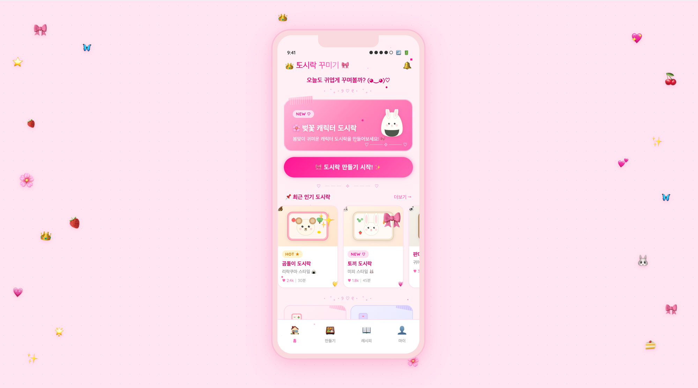
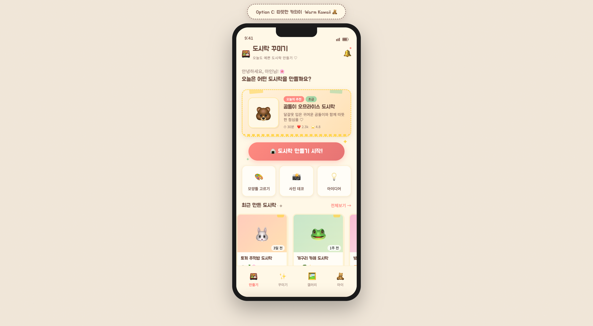
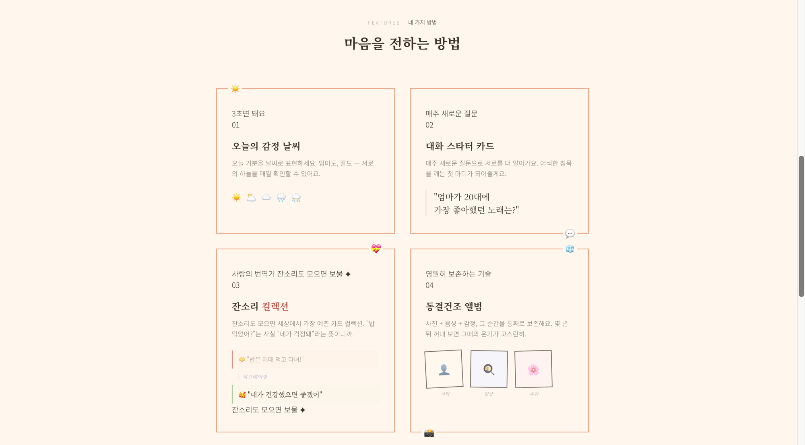
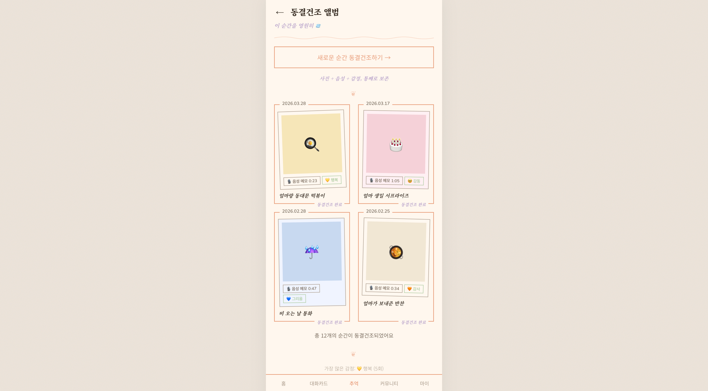
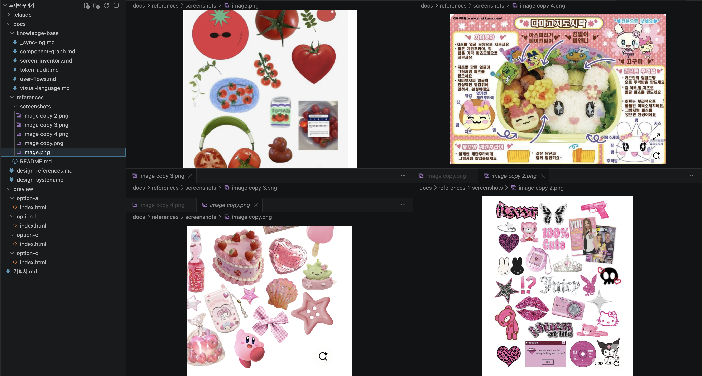

# Design Workflow Plugin for Claude Code

A workflow plugin for achieving production-grade design quality in vibe coding.

Structurally prevents common problems when building UI with AI — inconsistent colors, hardcoded styles, half-baked UI, and missing dark mode support.

---

## Examples

Moodboards / previews made with this plugin:

### Dosirak Kkumigi — Cute Lunchbox Design App

<p>
  
  
</p>

### Eommisae — Mother-Daughter Communication App

<p>
  
  
</p>

### Reference Collection in Action

The plugin guides you to collect design references (screenshots, moodboards) and organizes them within your project structure.



---

## Workflow

<picture>
  <source media="(prefers-color-scheme: dark)" srcset="docs/my_design_flow_skill_flow.svg">
  
</picture>

```
/design-start → Project init → PRD check
  ├─ No PRD → Co-create via conversation
  └─ Has PRD → Read file
→ /design-research (Reference collection + web search)
→ /moodboard-gen (Generate 3 design directions)
→ User picks one → Remove the rest
→ /design-system-gen (Finalize DESIGN.md tokens/rules)
→ /design-preview (Generate key screen code)
→ /design-feedback (Feedback → Revise → Repeat)
→ Start frontend development
```

> `/save-reference` can be called at any point to add references.

---

## Key Features

| Feature | Description |
|---------|-------------|
| **Conversational PRD** | Co-create a PRD through conversation, even without a planning doc |
| **Reference-based Design** | Set direction using web search + user-provided references |
| **3-option Moodboard** | Pick from 3 design directions, discard the rest |
| **Token-level Design System** | Manage consistent rules via DESIGN.md |
| **Feedback Loop** | Revise → Apply → Confirm, repeat until satisfied |

---

## Installation

### Plugin Install

```bash
claude plugin install my-design-flow
```

### Local Testing (Development)

```bash
claude --plugin-dir ./design-workflow-plugin
```

### Manual Install (Copy)

```bash
git clone https://github.com/hye-on/MY-DESIGN-FLOW.git /tmp/my-design-flow
cp -r /tmp/my-design-flow/ ~/.claude/plugins/my-design-flow/
```

---

## Dependencies

### Required
- [Claude Code](https://docs.anthropic.com/en/docs/claude-code) CLI
- `CLAUDE.md` file in your project

### Optional (Recommended)
- [Tailwind CSS](https://tailwindcss.com/) v3+
- [shadcn/ui](https://ui.shadcn.com/) component library
- [Lucide Icons](https://lucide.dev/)
- Chrome browser (for Claude in Chrome integration)

---

## Skill Commands

| Command | Description |
|---------|-------------|
| `/design-start` | Initialize project. Check PRD and start workflow |
| `/design-research` | Collect references + analyze via web search |
| `/moodboard-gen` | Generate 3 design directions. Uses option-d if user references exist |
| `/design-system-gen` | Finalize DESIGN.md — define tokens and rules |
| `/design-preview` | JSONC brief → Generate key screen code |
| `/design-feedback` | Feedback → Token-level revision → Repeat |
| `/save-reference` | Add references at any time |

---

## Plugin Structure

This plugin is split into a **shareable core** and a **personal extension area**.

### Plugin Core (Open Source)
- No automated scraping — references are provided by the user
- Complies with ToS of design sites (Mobbin, Dribbble, etc.)
- Safe to fork and share as-is

### local-only/ (Personal, git-ignored)
- Included in `.gitignore` — never pushed to remote
- Place for personal automation scripts (Playwright capture, Glance MCP calls, etc.)
- Ships empty, extend freely as needed

---

## Design Site ToS Notice

When collecting references:

- Always check the Terms of Service of design sites (Dribbble, Behance, Awwwards, etc.) before collecting screenshots
- Collected screenshots are for **learning/reference purposes only**
- Copying design elements directly may constitute copyright infringement
- Extract **patterns and principles** from references — do not replicate pixel-by-pixel
- Use only properly licensed assets for commercial projects

---

## Knowledge Base

The `knowledge-base/` folder tracks the design status of your project.

| File | Role |
|------|------|
| `screen-inventory.md` | All screens and their status (not started / preview / feedback / done) |
| `component-graph.md` | Component hierarchy and reuse relationships |
| `visual-language.md` | Tokenized vs. not-yet-tokenized values |
| `user-flows.md` | User flow map (extracted from PRD) |
| `token-audit.md` | Hardcoded values and suggested tokens |
| `_sync-log.md` | All knowledge-base change history |

---

## Hooks

### Pre-commit: Hardcoded Color Detection
Detects hardcoded color values (`#3B82F6`, `rgb(59, 130, 246)`, etc.) in staged files and warns.

### Post-edit: Knowledge Base Sync Trigger
Adds a `SYNC_NEEDED` flag to knowledge-base files that need updating when UI files are modified.

### Pre-commit: Component Duplication Check
Checks for existing similar components when a new component file is added.

---

## Contributing

1. Fork this repository
2. Create a feature branch (`git checkout -b feature/new-feature`)
3. Commit your changes
4. Create a pull request

### Guidelines
- Consider backward compatibility when modifying template files
- Add new rules as separate files in the `rules/` folder
- Include a migration guide when modifying knowledge-base templates

---

## License

[MIT License](../LICENSE)

---

<details>
<summary><h1>한국어 (Korean)</h1></summary>

# Design Workflow Plugin for Claude Code

바이브코딩에서 내가 만족할 만한 디자인 품질을 달성하기 위한 워크플로우 플러그인.

AI와 함께 UI를 만들 때 흔히 발생하는 문제들 — 일관성 없는 색상, 하드코딩된 스타일, 반쪽짜리 UI, 다크모드 미대응 — 을 구조적으로 방지합니다.

---

## 예시

이 플러그인으로 만든 무드보드/프리뷰들:

### 도시락 꾸미기 — 귀여운 도시락 디자인 앱

<p>
  
  
</p>

### 엄미새 — 엄마와 딸의 소통 앱

<p>
  
  
</p>

### 레퍼런스 수집 실제 화면

플러그인이 디자인 레퍼런스(스크린샷, 무드보드)를 수집하고 프로젝트 구조 안에 정리하는 과정입니다.


---

## 워크플로우

```
/design-start → 프로젝트 초기화 → PRD 확인
  ├─ 없으면 → 대화로 함께 작성
  └─ 있으면 → 파일 읽기
→ /design-research (레퍼런스 수집 + 웹 검색)
→ /moodboard-gen (3개 시안 생성)
→ 사용자 선택 → 나머지 삭제
→ /design-system-gen (DESIGN.md 토큰/규칙 확정)
→ /design-preview (핵심 화면 코드 생성)
→ /design-feedback (피드백 → 수정 → 반복)
→ 프론트 개발 진행
```

> `/save-reference`는 플로우 중 언제든 호출해서 레퍼런스를 추가할 수 있습니다.

---

## 핵심 특징

| 특징 | 설명 |
|------|------|
| **대화형 PRD 작성** | 기획 문서가 없어도 대화로 함께 만들어 감 |
| **레퍼런스 기반 디자인** | 웹 검색 + 사용자 레퍼런스로 방향 잡기 |
| **무드보드 3안 비교** | 시안 중 고르면 나머지는 정리 |
| **토큰 레벨 디자인 시스템** | DESIGN.md로 일관된 규칙 관리 |
| **피드백 루프** | 수정 → 반영 → 확인을 반복해서 원하는 결과까지 |

---

## 설치 방법

### 플러그인 설치

```bash
claude plugin install my-design-flow
```

### 개발 중 로컬 테스트

```bash
claude --plugin-dir ./design-workflow-plugin
```

### 수동 설치 (복사 방식)

```bash
git clone https://github.com/hye-on/MY-DESIGN-FLOW.git /tmp/my-design-flow
cp -r /tmp/my-design-flow/ ~/.claude/plugins/my-design-flow/
```

---

## 의존성

### 필수
- [Claude Code](https://docs.anthropic.com/en/docs/claude-code) CLI
- 프로젝트에 `CLAUDE.md` 파일

### 선택 (권장)
- [Tailwind CSS](https://tailwindcss.com/) v3 이상
- [shadcn/ui](https://ui.shadcn.com/) 컴포넌트 라이브러리
- [Lucide Icons](https://lucide.dev/)
- Chrome 브라우저 (Claude in Chrome 연동 시)

---

## 스킬 명령어

| 명령어 | 설명 |
|--------|------|
| `/design-start` | 프로젝트 초기화. PRD 확인 후 워크플로우 시작 |
| `/design-research` | 레퍼런스 수집 요청 + 웹 검색 분석 |
| `/moodboard-gen` | 3개 시안 생성. 사용자 레퍼런스 있으면 option-d |
| `/design-system-gen` | DESIGN.md 확정 — 토큰, 규칙 정의 |
| `/design-preview` | JSONC 브리프 → 핵심 화면 코드 생성 |
| `/design-feedback` | 피드백 → 토큰 레벨 수정 → 반복 |
| `/save-reference` | 언제든 호출해서 레퍼런스 추가 |

---

## 플러그인 구조

이 플러그인은 **공유 가능한 본체**와 **개인 확장 영역**으로 나뉩니다.

### 플러그인 본체 (오픈소스)
- 자동 스크래핑을 하지 않으며, 레퍼런스는 사용자가 직접 제공합니다
- Mobbin, Dribbble 등 디자인 사이트의 이용약관(ToS)을 준수합니다
- 그대로 포크하거나 공유해도 안전합니다

### local-only/ (개인 전용, git 미추적)
- `.gitignore`에 포함되어 원격 저장소에 올라가지 않습니다
- Playwright 자동 캡처, Glance MCP 호출 등 개인 자동화 스크립트를 넣는 공간입니다
- 빈 상태로 제공되며, 필요에 따라 자유롭게 확장할 수 있습니다

---

## 디자인 사이트 이용약관 (ToS) 고지

레퍼런스 수집 시 주의사항:

- Dribbble, Behance, Awwwards 등 디자인 사이트의 스크린샷을 수집할 때, 각 사이트의 이용약관을 반드시 확인하세요
- 수집된 스크린샷은 **학습/참고 목적**으로만 사용합니다
- 디자인 요소를 그대로 복사하는 것은 저작권 침해에 해당할 수 있습니다
- 레퍼런스에서 **패턴과 원칙**을 추출하되, 픽셀 단위의 복제는 하지 마세요
- 상업적 프로젝트에서는 유료 라이선스가 있는 에셋만 사용하세요

---

## Knowledge Base

`knowledge-base/` 폴더는 프로젝트의 디자인 현황을 추적합니다.

| 파일 | 역할 |
|------|------|
| `screen-inventory.md` | 전체 화면 목록과 각 화면의 상태 (미착수/프리뷰/피드백 중/완성) |
| `component-graph.md` | 공통 컴포넌트와 페이지별 컴포넌트의 의존 관계 |
| `visual-language.md` | 토큰화된 값과 아직 토큰화되지 않은 값 현황 |
| `user-flows.md` | 유저 플로우 맵 (PRD에서 추출) |
| `token-audit.md` | 하드코딩된 값 목록과 제안 토큰 |
| `_sync-log.md` | 모든 knowledge-base 변경 이력 |

---

## Hooks

### Pre-commit: 색상 하드코딩 감지
커밋할 파일에서 하드코딩된 색상값(`#3B82F6`, `rgb(59, 130, 246)` 등)을 감지하고 경고합니다.

### Post-edit: Knowledge Base 동기화 트리거
UI 파일 수정 시 knowledge-base 업데이트가 필요한 파일에 `SYNC_NEEDED` 플래그를 추가합니다.

### Pre-commit: 컴포넌트 중복 체크
새 컴포넌트 파일 추가 시 기존 유사 컴포넌트가 있는지 확인합니다.

---

## 기여 가이드

1. 이 저장소를 포크합니다
2. 기능 브랜치를 생성합니다 (`git checkout -b feature/새기능`)
3. 변경사항을 커밋합니다
4. 풀 리퀘스트를 생성합니다

### 주의사항
- 템플릿 파일 수정 시 기존 프로젝트와의 호환성을 고려하세요
- 새 규칙 추가 시 `rules/` 폴더에 별도 파일로 작성하세요
- knowledge-base 템플릿 수정 시 마이그레이션 가이드를 포함하세요

---

## 라이선스

[MIT License](../LICENSE)

</details>
